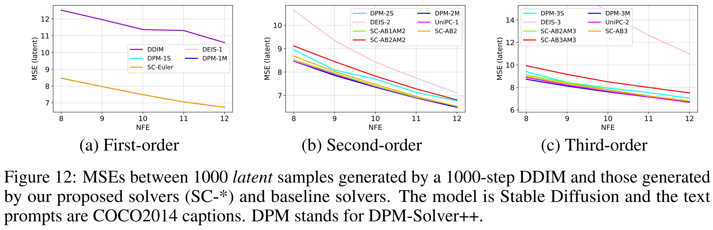
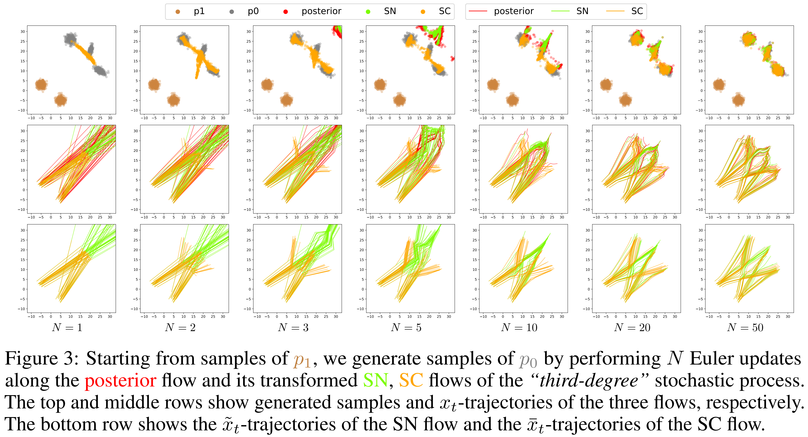

# Variational Flow Models: Flowing in Your Style


This repository contains the official implementation for experiments with [Stable Diffusion](https://arxiv.org/abs/2112.10752) in our paper:
> [**Variational Flow Models: Flowing in Your Style**](https://arxiv.org/abs/2402.02977)
>
> Do et al., 2024


## Required libraries
pytorch, diffusers, tqdm

## How to use the code
In this repository, we implement various numerical solvers on straight constant-speed (SC) flows which are described in our paper.
These solvers include:
- Euler solver (Euler)
- Runge-Kutta solvers (Heun, ExplicitMidpoint, ClassicKutta3)
- Adams-Bashforth solvers (AB2, AB3)
- Adams-Bashforth solvers with Adams-Moulton correctors (AB2C, AB3C)

The implementations of these solvers can be found in the file "diffusers_scheduler.py"

The python files starting with "exp_" are executable which demonstrate 
how to use the solvers above with [Stable Diffusion](https://huggingface.co/CompVis/stable-diffusion-v1-4) to generate images from input texts.

The quantitative and qualitative comparisons between our solvers and 
baseline solvers such as DPM-Solver++ and UniPC for the text-to-image generation task 
with Stable Diffusion are given below:

 


Here is a visualization of a straight constant-speed (SC) flow 
obtained by our method on a toy dataset:



## Citation
If you find this repository useful for your research, please consider citing our paper:

```bibtex
@article{do2024variational,
  title={Variational Flow Models: Flowing in Your Style},
  author={Do, Kien and Kieu, Duc and Nguyen, Toan and Nguyen, Dang and Le, Hung and Nguyen, Dung and Nguyen, Thin},
  journal={arXiv preprint arXiv:2402.02977},
  year={2024}
}
```
